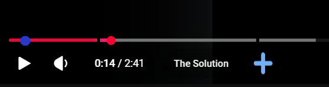
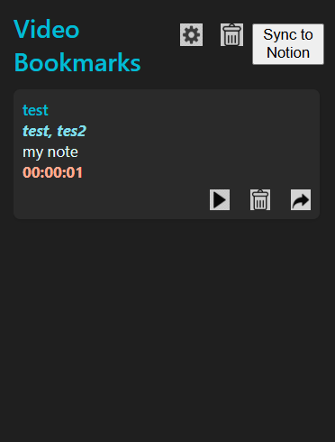
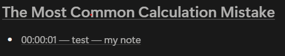

# YouTube Knowledge & Productivity Extension

A Chrome extension that enhances YouTube learning workflows by enabling timestamped bookmarking, knowledge organization, and productivity features directly inside the browser.

---

## Overview

This extension allows users to save, manage, and share timestamped bookmarks from YouTube videos. It also integrates with external tools like Notion and adds productivity features such as sponsor skipping and customizable browsing enhancements.

---

## Features

- Save timestamped bookmarks directly on YouTube videos
- Visual bookmark markers on the YouTube progress bar
- Edit, delete, and organize saved bookmarks
- Share bookmarks with others via links or export
- Sync bookmarks to Notion
- Automatically skip in-video sponsorship segments
- Bookmark management dashboard inside extension settings
- Popup interface for quick access to saved bookmarks
- Optional custom new-tab and navigation features

---

## Tech Stack

- JavaScript / TypeScript
- React (UI components)
- Chrome Extension APIs (Manifest V3)
- Notion API integration
- Background + content scripts architecture

---

## Architecture

- **Content Scripts**: Inject UI elements into YouTube (bookmark markers, timeline integration)
- **Background Service Worker**: Handles messaging, persistence, and automation logic
- **Popup UI**: Quick bookmark viewing and interaction
- **Notion Integration Layer**: Sends structured bookmarks to Notion databases/pages

---

## Installation & Usage

1. Clone the repository
2. Run `npm install` to install dependencies
3. Run `npm start` to start to start development build
4. Open Chrome and go to `chrome://extensions`, 
5. Enable developer mode from top right of the page
6. Click on load unpacked and select the projects build folder 

---

## Key Features in Action

1. Open any YouTube video
2. Click on plus (+) icon to add bookmark
3. Add notes, categories for the bookmark
3. View saved bookmarks via the extension popup
4. Click a bookmark to jump to that timestamp
5. Share and Edit bookmarks from the popup
5. Optionally sync selected bookmarks to Notion

---

## Future Improvements

- Machine learning-based auto chapter detection
- Better semantic grouping of bookmarks
- Cross-device sync system
- Improved Notion formatting templates

---

## Screenshots

